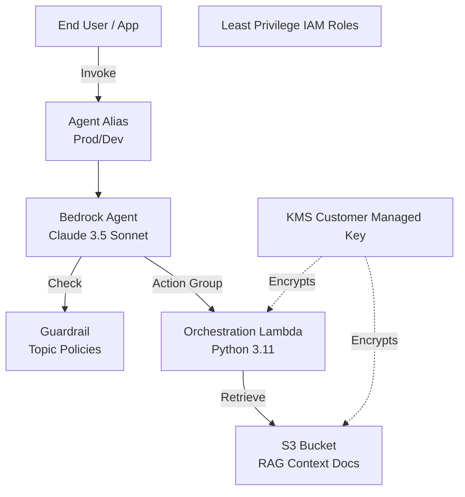

***

# Enterprise AWS Bedrock Agent Terraform Module


## 🚀 Overview

This repository contains a production-ready, reusable **Terraform Module** designed to deploy a secure, scalable **Retrieval-Augmented Generation (RAG)** architecture using **AWS Bedrock Agents**.

In the era of Generative AI, deploying agents manually is error-prone and unscalable. This module treats **GenAI Infrastructure as Code**, allowing DevOps engineers and Architects to spin up standardized, compliant, and fully integrated AI Agents across multiple environments (Dev, Test, Prod) with a single module block.

**Current Capabilities:** Deploys a secure Bedrock Agent backed by Anthropic Claude 3.5 Sonnet, integrated with S3 for context, Lambda for orchestration, and strict Guardrails for security.

---

## 🏗️ Architecture

### Current Implementation (Main Branch)
The current module deploys a **Single-Agent RAG Architecture**. It handles the complete lifecycle of the agent, from IAM roles to serverless compute encryption.


### 🌟 Future Roadmap: Multi-Agent Supervisor System
I am actively developing the next evolution of this module to support **Agentic Workflows**. The upcoming releases will introduce a **Supervisor-Worker** architecture.



---

## ✨ Key Features

*   **Modular Design:** Decouples configuration (names, tags) from logic. Designed to be consumed by multiple environments (`dev`, `staging`, `prod`) simultaneously.
*   **Security First:**
    *   **Guardrails:** Pre-configured constraints to prevent off-topic hallucinations (e.g., Competitor mentions blocked).
    *   **Encryption:** Full KMS integration for S3 buckets and CloudWatch Logs.
    *   **IAM:** Granular, least-privilege policies automatically generated.
*   **Serverless Action Groups:** automatically zips and deploys Python Lambda functions to act as the Agent's "hands," enabling it to fetch real-time data.
*   **Dynamic S3 Storage:** Provisions unique S3 buckets for document ingestion with secure access blocks.
*   **Observability:** Integrated CloudWatch logging for Agent traces and Lambda execution logs.

---

## 📂 Project Structure

This module follows standard Terraform best practices, separating resources by logical function.

```text
.
├── bedrock.tf          # Core Agent, Action Groups, and Aliases
├── guardrails.tf       # Safety policies and PII filtering
├── iam.tf              # Role assumptions and policy attachments
├── kms.tf              # Encryption key management
├── lambda.tf           # Python function deployment and zipping
├── lambda_src/         # Source code for the Agent's Action Group
│   └── app.py
├── logs.tf             # CloudWatch Log Group configuration
├── s3.tf               # Context storage bucket
├── variables.tf        # Input definitions (Service Name, Tags)
├── outputs.tf          # Return values (Agent ID, ARN, Bucket Name)
└── versions.tf         # Provider constraints
```

---

## 🛠️ Usage Guide

To use this module in your infrastructure, reference the Git repository in your `main.tf` file.

### 1. Define the Module
```hcl
module "bedrock_rag_agent" {
  source = "git::ssh://git@github.com/YOUR_USERNAME/terraform-aws-bedrock-module.git?ref=main"

  # Unique service name to prefix all resources
  service_name = "enterprise-fin-ops-agent"

  # Standard tagging strategy
  tags = {
    Environment = "Production"
    Department  = "Finance"
    Project     = "GenAI-Transformation"
    ManagedBy   = "Terraform"
  }
}
```

### 2. Provision Infrastructure
```bash
terraform init
terraform plan
terraform apply
```

### 3. Access Outputs
The module returns critical IDs needed for CI/CD or application integration:
```bash
# Output Example
bedrock_agent_alias_id = "TSTALIASID"
s3_context_bucket      = "enterprise-fin-ops-agent-context-docs-x8s7d9"
```

---

## 🚀 Roadmap & Future Improvements

I am continuously iterating on this module to bring state-of-the-art GenAI capabilities to Infrastructure-as-Code.

| Status | Feature | Description |
| :--- | :--- | :--- |
| ✅ | **Core RAG Module** | Base Agent, Guardrails, Lambda, S3, KMS. |
| 🚧 | **Supervisor Agent** | Implementation of a "Boss" agent to route queries. |
| 📅 | **SQL Agent** | Sub-agent capability to generate and execute Athena SQL queries. |
| 📅 | **Vector Integration** | Native integration with OpenSearch Serverless for Knowledge Bases. |
| 📅 | **Classifier Logic** | Embedded routing logic to distinguish between Reasoning vs. Retrieval tasks. |

---

## 🤝 Connect

This project represents my commitment to building scalable, secure, and modern AI infrastructure. If you are interested in **Cloud Architecture, Terraform, or Generative AI**, let's connect!

[](https://www.linkedin.com/in/YOUR-LINKEDIN-HANDLE)

---
* Maintained by [Sanskar Gupta]*
